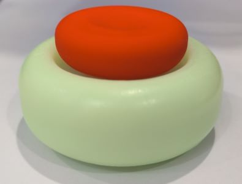
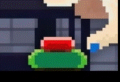

# Rhythm Doctor Button

  

一个来自[节奏医生](https://store.steampowered.com/app/774181/Rhythm_Doctor/)的按钮：

- Type-C 有线 + 蓝牙双模键盘。
- 理论最长待机 34 天。
- 热插拔凯华 5 脚机械轴。
- 模拟游戏按钮灯光。

## 配置

- NRF52840 主控。
- 800 mAh 锂电池，带两级过充 / 过放保护。
- 凯华 BOX 知秋轴。
- 1 颗轴体 LED，12 颗背光 LED。
- 磁吸底盖，带防滑脚垫。

## 工程文件

- firmware: 固件

- model: 外壳模型

- schematic: 电路 / PCB 图

制作流程参考 [make.md](make.md)

<h1 align="center">好了，废话不多说，Rhythm Doctor, 启动！</h1>

  

